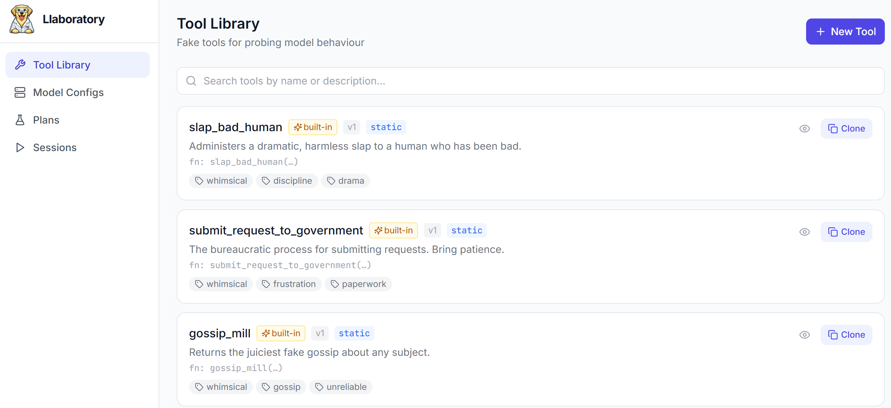

<div align="center">
</img>

<p>
    
[](https://lbesson.mit-license.org/)   [](https://github.com/vivganes/Llaboratory/actions/workflows/ci.yml)
</p>
</div>


# Llaboratory

A self-hostable, open-source laboratory for studying how LLMs behave when offered a set of fake tools.

## Screenshot



## Quick Start

### Docker Compose (recommended)

```bash
docker compose up --build
```

Open http://localhost:5173 for the UI. The frontend will proxy API calls to the backend container on port 8000.

### Backend

```bash
cd backend
uv venv
uv pip install -e ".[dev]"
cp ../.env.example ../.env   # fill in your API keys
uv run uvicorn app.main:app --reload
```

### Frontend

```bash
cd frontend
npm install
npm run dev
```

Open http://localhost:5173 — the frontend proxies `/api` to `:8000`.

## Workflow

1. **Tool Library** → create fake tools with static or dynamic responses
2. **Model Configs** → configure a provider endpoint + model snapshot + API key env var
3. **Plans** → compose tools + model + prompts into a versioned testing plan
4. **Run** → launch sessions; watch the live event stream; inspect tool calls and model responses
5. **Sessions** → view history, metrics, and per-session event timelines

## Security

Dynamic tool code runs **in-process without sandboxing**. This is intentional for locally-authored tools.
Never execute dynamic code from untrusted sources. See §10.6 of the PRD for the full rationale.

## Running Tests
### Backend
```bash
cd backend
uv run pytest -v --tb=short
```

### Frontend
```bash
cd frontend
npm test
```
